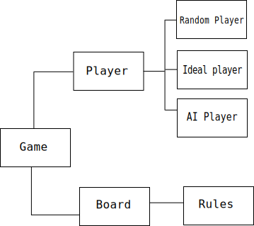

# Othello Design

## Aim

The aim of this project is to build an AI player capable of playing Othello after learning the game on its own. The only data given to the player will be logs of previously played games.

* **Input**: The board position
* **Output**: The next move

## Architecture

* **Player**: An interface which gets implemented by all player classes. (Helps comforming to a standard)
	- **Random Player**: A player which just moves randomly
	- **Ideal Player**: A player which never loses. (search for a strong library)
	- **AI Player**: The player which is being built.
* **Board**: A class which holds the positional information of the coins along with data such as `turn to move`, etc
* **Rules**: (Not sure if a separate class is needed) Holds the rule information for the game
* **Game**: A binder module which glues everything together
